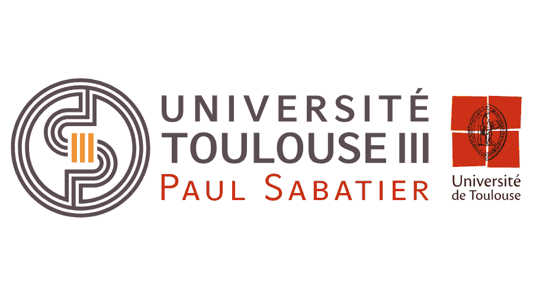

# Iterative reconstruction networks


**[Paper](https://arxiv.org/abs/1901.03707)** | **[Video Tutorials](https://www.youtube.com/watch?v=IMnjiYyHnpg)** | **[Master Degree website](https://departement-informatique.univ-tlse3.fr/master-igai/)** 

**This project** is forked from [dgilton's repository](https://github.com/dgilton/iterative_reconstruction_networks). 


## Getting Started 
#### Set the conda environnement

Or you can install packages manually

```bash
$ conda env create --file conda-env.yml 
$ conda activate neumaNN_env
```
#### Download the dataset

```bash
$ ./scripts/download_celeba.sh
```

#### Train the model
```bash
$ python scripts/train/gaussian_blur_neumann.py    
```
###### Or use our pretrained model
by copying any file located in "data/save/celeba/checkpoints" to "data/save/gaussianblur_neumann.ckpt". 
#### Test the model 
```bash
$ python scripts/test/gaussian_blur_neumann.py
```

## Some results


## Contributors

* https://github.com/Aclardgm
* https://github.com/seb2s

